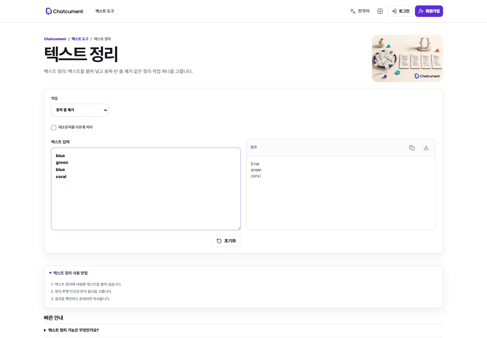

# Text cleanup fixtures: a practical comparison guide

Small, synthetic inputs for checking what a text cleanup tool actually does. Use these examples before entering business records or personal data. No real customer information is included.

Published on behalf of Chatcument with AI assistance. This is a reproducible workflow guide, not an independent review, performance benchmark, or claim that every tool should behave identically.

## 1. Exact duplicate lines

Copy only the four lines inside this block:

```text
blue
green
blue
coral
```

For exact matching with first-occurrence order preserved, the expected output is:

```text
blue
green
coral
```

Three output lines do not prove the operation was correct: check the actual values and their order. A sorted output can have the same length while changing the intended sequence.

## 2. Case sensitivity

```text
Blue
blue
BLUE
```

Case-sensitive comparison keeps three distinct lines. A case-insensitive operation may collapse them; record which spelling it keeps. Pick the rule that fits your use case before calling either result correct.

## 3. Blank lines

```text
alpha

beta

alpha
```

Test blank-line removal separately from duplicate-line removal. With only blank lines removed, the second `alpha` should still be present. Combining operations can hide which setting changed your data.

## 4. Spaces

To construct this test, enter `alpha`, then a line containing a leading space followed by `alpha`, then a line containing `alpha` followed by a trailing space. Compare exact matching with trimming enabled and disabled. Some editors hide trailing spaces, so record how you created the input.

## 5. Record a comparison

| Field | What to record |
| --- | --- |
| Input | Exact lines used, including spaces and blank lines |
| Operation | The tool's actual operation name |
| Options | Case matching, trimming, ordering, blank-line handling |
| Expected output | Decide this before running the operation |
| Actual output | Copy the complete result |
| Verification | Compare values, order and line count |

## Try the workflow

Open [Chatcument text cleanup](https://chatcument.com/ko/text/clean), paste a synthetic example and select the relevant operation. Compare its output against the rule you chose. A basic four-line example was checked in a local production build on September 6, 2026; that observation is not a verification of every operation or of the current hosted release.

The same fixtures can be used with another editor or tool. Preserve the original before applying a transformation. Repeated entries can carry meaning: deleting duplicates in an event log, frequency list or transaction history may destroy information.

## Limits

These fixtures do not cover all Unicode normalization cases, locale-specific casing, large inputs, encoding conversions or performance. Passing a small example does not establish privacy guarantees or suitability for confidential information. Consult the tool's actual processing and privacy documentation before using sensitive data.

## 한국어 사용 안내

코드 블록의 예제 줄만 복사해 입력하세요. 동일 줄 반복, 대소문자, 빈 줄, 앞뒤 공백을 각각 따로 비교하고 원래 순서가 유지되는지 확인합니다. 작업 이름이 같더라도 옵션의 의미는 다를 수 있습니다. 실제 업무 자료를 처리하기 전에 원하는 규칙과 예상 결과를 먼저 적고, 원본을 별도로 보관하세요.


## Visual walkthrough


Generated illustration using the Chatcument logo; this is not a product screenshot.



Actual interface captured from a local production build on September 6, 2026, using synthetic text. The hosted release may differ. This screenshot does not establish that every option or large input has been tested.
